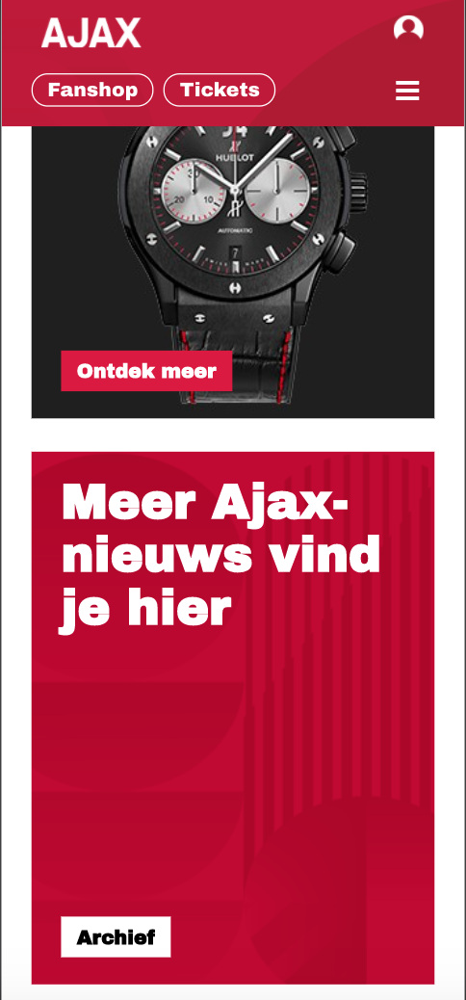

# Procesverslag
**Auteur:** Jody Lorist

Markdown cheat cheet: [Hulp bij het schrijven van Markdown](https://github.com/adam-p/markdown-here/wiki/Markdown-Cheatsheet). Nb. de standaardstructuur en de spartaanse opmaak zijn helemaal prima. Het gaat om de inhoud van je procesverslag. Besteedt de tijd voor pracht en praal aan je website.

## Bronnenlijst
1. -bron 1-
2. -bron 2-
3. -...-

## Eindgesprek (week 7/8)

-dit ging goed & dit was lastig-

**Screenshot(s):**

-screenshot(s) van je eindresultaat-

## Voortgang 3 (week 6)

### Stand van zaken

Ik zat deze week een beetje te klooien met mijn footer responsive te maken. Dit wilde namelijk niet helemaal. Uiteindelijk heb ik het wel zelf weten op te lossen. Verders ben ik begonnen aan de tweede pagina. Hier zou ik niet al te lang over moeten doen. De eerste pagina is al zo goed als responsive, alleen de header moet nog gebeuren. De tweede pagina moet nog responsive gemaakt worden. Waarschijnlijk word dit niet een al te groot probleem.

**Screenshot(s):**

### Agenda voor meeting

Benthe wilde iets vragen over haar hamburger menu en over media queries. Van andere hebben we helaas niks gehoord waar ze het in de meeting over willen hebben. Ik heb zelf aangegeven dat ik zelf geen uitleg nodig heb over een bepaald onderwerp.

## Voortgang 2 (week 5)

### Stand van zaken

Bij mij ging het eigenlijk wel goed en zonder problemen. Ik heb mijn eerste pagina weten af te maken en ook al bijna responsive. Ik hoef nu nog maar een pagina te maken en dan ben ik klaar.

**Screenshot(s):**

### Agenda voor meeting

Ik heb zelf niet echt bepaalde onderwerpen waar ik meer uitleg over wil hebben, maar een paar mensen uit mijn groepje wilde het hebben over positioneren van elementen en bewerken van forms. Ook wilde sommige weten waar ze op hun site beter grid kunnen gebruiken in plaats van flexbox.

## Voortgang 1 (week 3)

### Stand van zaken

Het ging eigenlijk gelijk goed om de javascript te implementeren. Ik heb er namelijk voor gezorgd dat de navbar kleiner wordt op moment dat de gebruiker naar beneden scrollt. Ook heb ik er voor gezorgd met javascript dat het menu kan uitklappen als erop wordt geklikt. Wel had ik eventjes moeite om de navbar in een flexbox te doen. Uiteindelijk is dit me wel snel gelukt.

**Screenshot(s):**

### Agenda voor meeting

We hadden nog niet echt een idee hoe we dit moesten invullen, maar we hadden wel een volgorde aangemaakt wie als eerste zijn werk zou laten zien. Ik zou als laatste gaan. Ik wil vooral feedback op mijn navbar. Ook wil ik weten hoe ik ervoor kan zorgen dat wanneer de sponsoren op de navbar verdwijnen, dat die dan met een transition weg vervagen.

### Verslag van meeting

Tijdens de meeting is er mij goed uitgelegd hoe ik de sponsoren in de navbar met een transitie kon laten verdwijnen. Dit moest doormiddel van een animation. Na de meeting kon ik hier dus mee verder.

## Intake (week 1)

**Je startniveau:** zwarte

**Je focus:** surface plane (wil beide proberen, maar ga eerst hier mee beginnen)

**Je opdracht:** https://jody29.github.io/Frontend-Development/

**Screenshot(s):

**Breakdown-schets(en):

